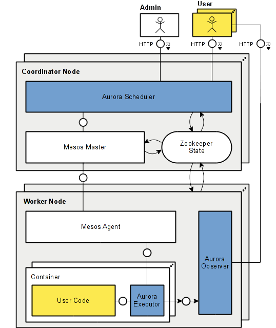
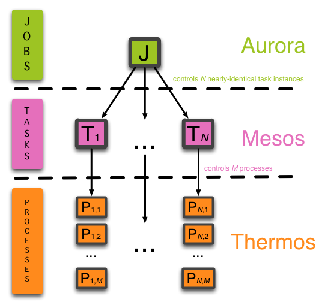

Aurora System Overview
======================

Apache Aurora is a service scheduler that runs on top of Apache Mesos, enabling you to run
long-running services, cron jobs, and ad-hoc jobs that take advantage of Apache Mesos' scalability,
fault-tolerance, and resource isolation.

Components
----------

It is important to have an understanding of the components that make up
a functioning Aurora cluster.

* **Aurora scheduler**
  The scheduler is your primary interface to the work you run in your cluster.  You will
  instruct it to run jobs, and it will manage them in Mesos for you.  You will also frequently use
  the scheduler's read-only web interface as a heads-up display for what's running in your cluster.

* **Aurora client**
  The client (`aurora` command) is a command line tool that exposes primitives that you can use to
  interact with the scheduler. The client operates on

  Aurora also provides an admin client (`aurora_admin` command) that contains commands built for
  cluster administrators.  You can use this tool to do things like manage user quotas and manage
  graceful maintenance on machines in cluster.

* **Aurora executor**
  The executor (a.k.a. Thermos executor) is responsible for carrying out the workloads described in
  the Aurora DSL (`.aurora` files).  The executor is what actually executes user processes.  It will
  also perform health checking of tasks and register tasks in ZooKeeper for the purposes of dynamic
  service discovery.

* **Aurora observer**
  The observer provides browser-based access to the status of individual tasks executing on worker
  machines.  It gives insight into the processes executing, and facilitates browsing of task sandbox
  directories.

* **ZooKeeper**
  [ZooKeeper](http://zookeeper.apache.org) is a distributed consensus system.  In an Aurora cluster
  it is used for reliable election of the leading Aurora scheduler and Mesos master.  It is also
  used as a vehicle for service discovery, see [Service Discovery](../../features/service-discovery/)

* **Mesos master**
  The master is responsible for tracking worker machines and performing accounting of their
  resources.  The scheduler interfaces with the master to control the cluster.

* **Mesos agent**
  The agent receives work assigned by the scheduler and executes them.  It interfaces with Linux
  isolation systems like cgroups, namespaces and Docker to manage the resource consumption of tasks.
  When a user task is launched, the agent will launch the executor (in the context of a Linux cgroup
  or Docker container depending upon the environment), which will in turn fork user processes.

Jobs, Tasks and Processes
--------------------------

Aurora is a Mesos framework used to schedule *jobs* onto Mesos. Mesos
cares about individual *tasks*, but typical jobs consist of dozens or
hundreds of task replicas. Aurora provides a layer on top of Mesos with
its `Job` abstraction. An Aurora `Job` consists of a task template and
instructions for creating near-identical replicas of that task (modulo
things like "instance id" or specific port numbers which may differ from
machine to machine).

How many tasks make up a Job is complicated. On a basic level, a Job consists of
one task template and instructions for creating near-identical replicas of that task
(otherwise referred to as "instances" or "shards").

A task can merely be a single *process* corresponding to a single
command line, such as `python2.7 my_script.py`. However, a task can also
consist of many separate processes, which all run within a single
sandbox. For example, running multiple cooperating agents together,
such as `logrotate`, `installer`, master, or slave processes. This is
where Thermos comes in. While Aurora provides a `Job` abstraction on
top of Mesos `Tasks`, Thermos provides a `Process` abstraction
underneath Mesos `Task`s and serves as part of the Aurora framework's
executor.

You define `Job`s,` Task`s, and `Process`es in a configuration file.
Configuration files are written in Python, and make use of the
[Pystachio](https://github.com/wickman/pystachio) templating language,
along with specific Aurora, Mesos, and Thermos commands and methods.
The configuration files typically end with a `.aurora` extension.

Summary:

* Aurora manages jobs made of tasks.
* Mesos manages tasks made of processes.
* Thermos manages processes.
* All that is defined in `.aurora` configuration files

Each `Task` has a *sandbox* created when the `Task` starts and garbage
collected when it finishes. All of a `Task'`s processes run in its
sandbox, so processes can share state by using a shared current working
directory.

The sandbox garbage collection policy considers many factors, most
importantly age and size. It makes a best-effort attempt to keep
sandboxes around as long as possible post-task in order for service
owners to inspect data and logs, should the `Task` have completed
abnormally. But you can't design your applications assuming sandboxes
will be around forever, e.g. by building log saving or other
checkpointing mechanisms directly into your application or into your
`Job` description.

