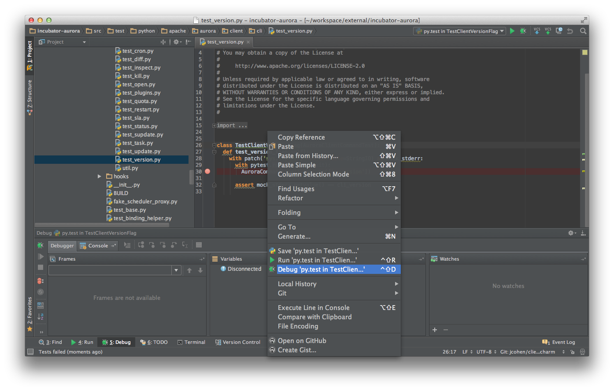
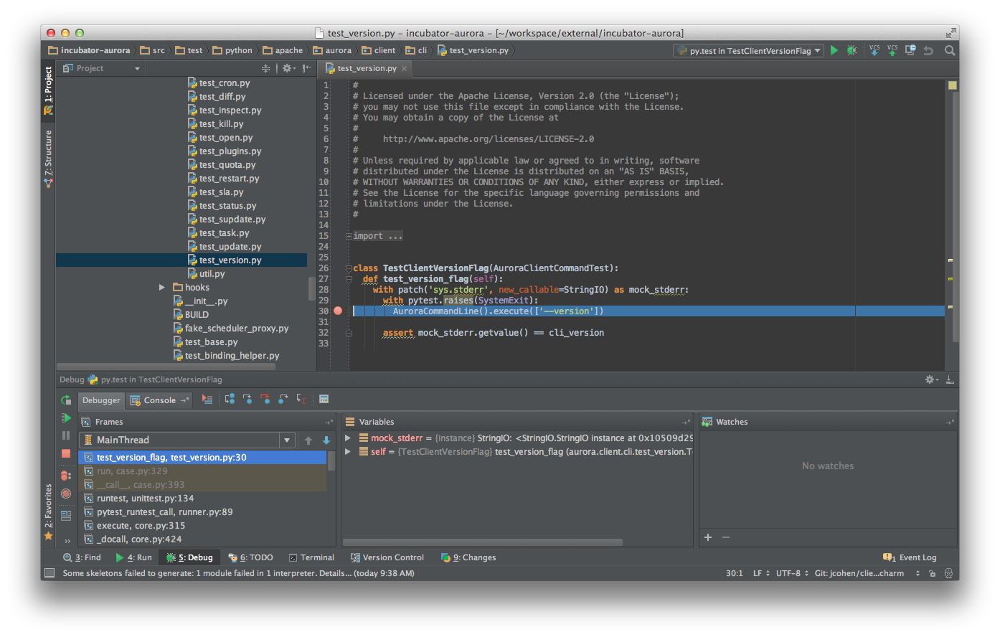

Developing the Aurora Client
============================

The client is written in Python, and uses the
[Pants](http://pantsbuild.github.io/python-readme.html) build tool.

Building and Testing
--------------------

Building and testing the client code are both done using Pants. The relevant targets to know about
are:

   * Build a client executable: `./pants binary src/main/python/apache/aurora/client:aurora`
   * Test client code: `./pants test src/test/python/apache/aurora/client/cli:cli`

If you want to build a source distribution of the client, you need to run `./build-support/release/make-python-sdists`.

Running/Debugging
------------------

For manually testing client changes against a cluster, we use [Vagrant](https://www.vagrantup.com/).
To start a virtual cluster, you need to install Vagrant, and then run `vagrant up` for the root of
the aurora workspace. This will create a vagrant host named "devcluster", with a Mesos master, a set
of Mesos agents, and an Aurora scheduler.

If you have a change you would like to test in your local cluster, you'll rebuild the client:

    vagrant ssh -c 'aurorabuild client'

Once this completes, the `aurora` command will reflect your changes.

Running/Debugging in PyCharm
-----------------------------

It's possible to use PyCharm to run and debug both the client and client tests in an IDE. In order
to do this, first run:

    build-support/python/make-pycharm-virtualenv

This script will configure a virtualenv with all of our Python requirements. Once the script
completes it will emit instructions for configuring PyCharm:

    Your PyCharm environment is now set up.  You can open the project root
    directory with PyCharm.

    Once the project is loaded:
      - open project settings
      - click 'Project Interpreter'
      - click the cog in the upper-right corner
      - click 'Add Local'
      - select 'build-support/python/pycharm.venv/bin/python'
      - click 'OK'

### Running/Debugging Tests
After following these instructions, you should now be able to run/debug tests directly from the IDE
by right-clicking on a test (or test class) and choosing to run or debug:

If you've set a breakpoint, you can see the run will now stop and let you debug:

### Running/Debugging the Client
Actually running and debugging the client is unfortunately a bit more complex. You'll need to create
a Run configuration:

* Go to Run → Edit Configurations
* Click the + icon to add a new configuration.
* Choose python and name the configuration 'client'.
* Set the script path to `/your/path/to/aurora/src/main/python/apache/aurora/client/cli/client.py`
* Set the script parameters to the command you want to run (e.g. `job status <job key>`)
* Expand the Environment section and click the ellipsis to add a new environment variable
* Click the + at the bottom to add a new variable named AURORA_CONFIG_ROOT whose value is the
  path where the your cluster configuration can be found. For example, to talk to the scheduler
  running in the vagrant image, it would be set to `/your/path/to/aurora/examples/vagrant` (this
  is the directory where our example clusters.json is found).
* You should now be able to run and debug this configuration!
