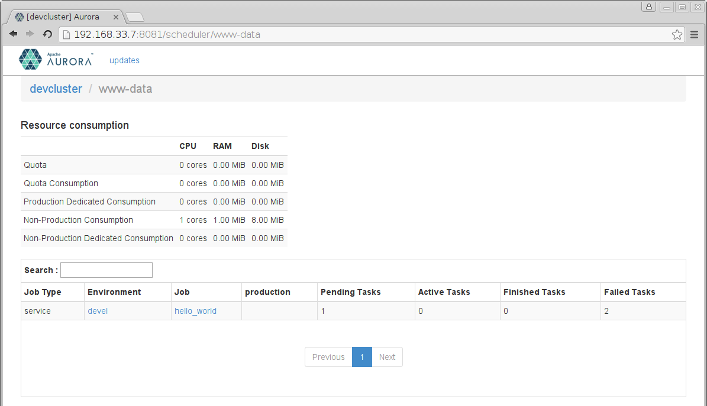
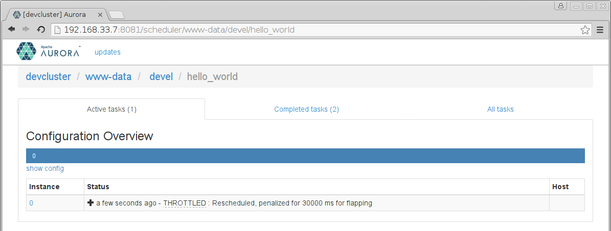
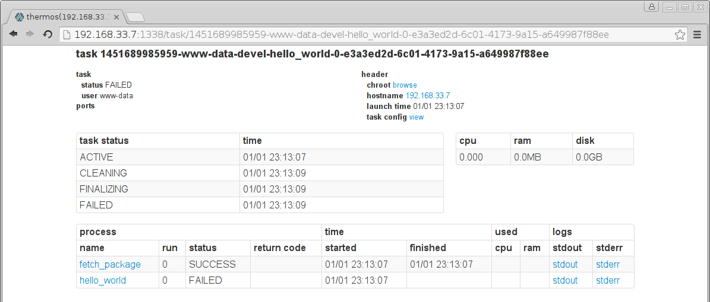
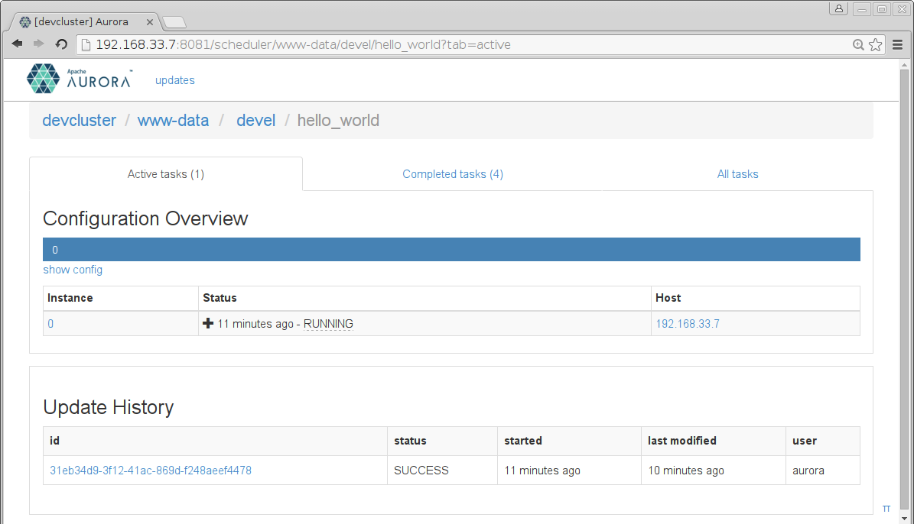
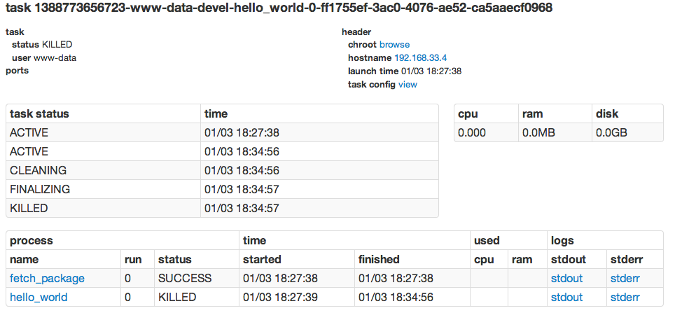

# Aurora Tutorial

This tutorial shows how to use the Aurora scheduler to run (and "`printf-debug`")
a hello world program on Mesos. This is the recommended document for new Aurora users
to start getting up to speed on the system.

- [Prerequisite](#setup-install-aurora)
- [The Script](#the-script)
- [Aurora Configuration](#aurora-configuration)
- [Creating the Job](#creating-the-job)
- [Watching the Job Run](#watching-the-job-run)
- [Cleanup](#cleanup)
- [Next Steps](#next-steps)


## Prerequisite

This tutorial assumes you are running [Aurora locally using Vagrant](../vagrant/).
However, in general the instructions are also applicable to any other
[Aurora installation](../../operations/installation/).

Unless otherwise stated, all commands are to be run from the root of the aurora
repository clone.


## The Script

Our "hello world" application is a simple Python script that loops
forever, displaying the time every few seconds. Copy the code below and
put it in a file named `hello_world.py` in the root of your Aurora repository clone
(Note: this directory is the same as `/vagrant` inside the Vagrant VMs).

The script has an intentional bug, which we will explain later on.

<!-- NOTE: If you are changing this file, be sure to also update examples/vagrant/test_tutorial.sh.
-->
```python
import time

def main():
  SLEEP_DELAY = 10
  # Python experts - ignore this blatant bug.
  for i in xrang(100):
    print("Hello world! The time is now: %s. Sleeping for %d secs" % (
      time.asctime(), SLEEP_DELAY))
    time.sleep(SLEEP_DELAY)

if __name__ == "__main__":
  main()
```

## Aurora Configuration

Once we have our script/program, we need to create a *configuration
file* that tells Aurora how to manage and launch our Job. Save the below
code in the file `hello_world.aurora`.

<!-- NOTE: If you are changing this file, be sure to also update examples/vagrant/test_tutorial.sh.
-->
```python
pkg_path = '/vagrant/hello_world.py'

# we use a trick here to make the configuration change with
# the contents of the file, for simplicity.  in a normal setting, packages would be
# versioned, and the version number would be changed in the configuration.
import hashlib
with open(pkg_path, 'rb') as f:
  pkg_checksum = hashlib.md5(f.read()).hexdigest()

# copy hello_world.py into the local sandbox
install = Process(
  name = 'fetch_package',
  cmdline = 'cp %s . && echo %s && chmod +x hello_world.py' % (pkg_path, pkg_checksum))

# run the script
hello_world = Process(
  name = 'hello_world',
  cmdline = 'python -u hello_world.py')

# describe the task
hello_world_task = SequentialTask(
  processes = [install, hello_world],
  resources = Resources(cpu = 1, ram = 1*MB, disk=8*MB))

jobs = [
  Service(cluster = 'devcluster',
          environment = 'devel',
          role = 'www-data',
          name = 'hello_world',
          task = hello_world_task)
]
```

There is a lot going on in that configuration file:

1. From a "big picture" viewpoint, it first defines two
Processes. Then it defines a Task that runs the two Processes in the
order specified in the Task definition, as well as specifying what
computational and memory resources are available for them.  Finally,
it defines a Job that will schedule the Task on available and suitable
machines. This Job is the sole member of a list of Jobs; you can
specify more than one Job in a config file.

2. At the Process level, it specifies how to get your code into the
local sandbox in which it will run. It then specifies how the code is
actually run once the second Process starts.

For more about Aurora configuration files, see the [Configuration
Tutorial](../../reference/configuration-tutorial/) and the [Configuration
Reference](../../reference/configuration/) (preferably after finishing this
tutorial).


## Creating the Job

We're ready to launch our job! To do so, we use the Aurora Client to
issue a Job creation request to the Aurora scheduler.

Many Aurora Client commands take a *job key* argument, which uniquely
identifies a Job. A job key consists of four parts, each separated by a
"/". The four parts are  `<cluster>/<role>/<environment>/<jobname>`
in that order:

* Cluster refers to the name of a particular Aurora installation.
* Role names are user accounts existing on the agent machines. If you
don't know what accounts are available, contact your sysadmin.
* Environment names are namespaces; you can count on `test`, `devel`,
`staging` and `prod` existing.
* Jobname is the custom name of your job.

When comparing two job keys, if any of the four parts is different from
its counterpart in the other key, then the two job keys identify two separate
jobs. If all four values are identical, the job keys identify the same job.

The `clusters.json` [client configuration](../../reference/client-cluster-configuration/)
for the Aurora scheduler defines the available cluster names.
For Vagrant, from the top-level of your Aurora repository clone, do:

    $ vagrant ssh

Followed by:

    vagrant@aurora:~$ cat /etc/aurora/clusters.json

You'll see something like the following. The `name` value shown here, corresponds to a job key's cluster value.

```javascript
[{
  "name": "devcluster",
  "zk": "192.168.33.7",
  "scheduler_zk_path": "/aurora/scheduler",
  "auth_mechanism": "UNAUTHENTICATED",
  "slave_run_directory": "latest",
  "slave_root": "/var/lib/mesos"
}]
```

The Aurora Client command that actually runs our Job is `aurora job create`. It creates a Job as
specified by its job key and configuration file arguments and runs it.

    aurora job create <cluster>/<role>/<environment>/<jobname> <config_file>

Or for our example:

    aurora job create devcluster/www-data/devel/hello_world /vagrant/hello_world.aurora

After entering our virtual machine using `vagrant ssh`, this returns:

    vagrant@aurora:~$ aurora job create devcluster/www-data/devel/hello_world /vagrant/hello_world.aurora
     INFO] Creating job hello_world
     INFO] Checking status of devcluster/www-data/devel/hello_world
    Job create succeeded: job url=http://aurora.local:8081/scheduler/www-data/devel/hello_world


## Watching the Job Run

Now that our job is running, let's see what it's doing. Access the
scheduler web interface at `http://$scheduler_hostname:$scheduler_port/scheduler`
Or when using `vagrant`, `http://192.168.33.7:8081/scheduler`
First we see what Jobs are scheduled:


Click on your user name, which in this case was `www-data`, and we see the Jobs associated
with that role:



If you click on your `hello_world` Job, you'll see:



Oops, looks like our first job didn't quite work! The task is temporarily throttled for
having failed on every attempt of the Aurora scheduler to run it. We have to figure out
what is going wrong.

On the Completed tasks tab, we see all past attempts of the Aurora scheduler to run our job.


We can navigate to the Task page of a failed run by clicking on the host link.



Once there, we see that the `hello_world` process failed. The Task page
captures the standard error and standard output streams and makes them available.
Clicking through to `stderr` on the failed `hello_world` process, we see what happened.


It looks like we made a typo in our Python script. We wanted `xrange`,
not `xrang`. Edit the `hello_world.py` script to use the correct function
and save it as `hello_world_v2.py`. Then update the `hello_world.aurora`
configuration to the newest version.

In order to try again, we can now instruct the scheduler to update our job:

    vagrant@aurora:~$ aurora update start devcluster/www-data/devel/hello_world /vagrant/hello_world.aurora
     INFO] Starting update for: hello_world
    Job update has started. View your update progress at http://aurora.local:8081/scheduler/www-data/devel/hello_world/update/8ef38017-e60f-400d-a2f2-b5a8b724e95b

This time, the task comes up.



By again clicking on the host, we inspect the Task page, and see that the
`hello_world` process is running.


We then inspect the output by clicking on `stdout` and see our process'
output:


## Cleanup

Now that we're done, we kill the job using the Aurora client:

    vagrant@aurora:~$ aurora job killall devcluster/www-data/devel/hello_world
     INFO] Killing tasks for job: devcluster/www-data/devel/hello_world
     INFO] Instances to be killed: [0]
    Successfully killed instances [0]
    Job killall succeeded

The job page now shows the `hello_world` tasks as completed.



## Next Steps

Now that you've finished this Tutorial, you should read or do the following:

- [The Aurora Configuration Tutorial](../../reference/configuration-tutorial/), which provides more examples
  and best practices for writing Aurora configurations. You should also look at
  the [Aurora Configuration Reference](../../reference/configuration/).
- Explore the Aurora Client - use `aurora -h`, and read the
  [Aurora Client Commands](../../reference/client-commands/) document.
