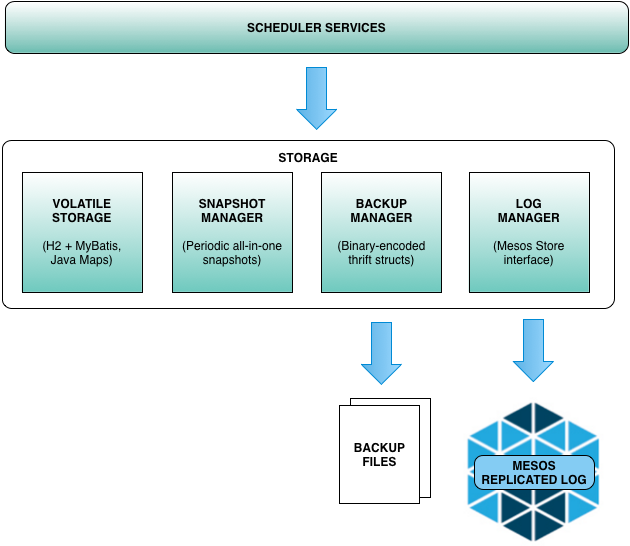

#Aurora Scheduler Storage

- [Overview](#overview)
- [Reads, writes, modifications](#reads-writes-modifications)
  - [Read lifecycle](#read-lifecycle)
  - [Write lifecycle](#write-lifecycle)
- [Atomicity, consistency and isolation](#atomicity-consistency-and-isolation)
- [Population on restart](#population-on-restart)

## Overview

Aurora scheduler maintains data that need to be persisted to survive failovers and restarts.
For example:

* Task configurations and scheduled task instances
* Job update configurations and update progress
* Production resource quotas
* Mesos resource offer host attributes

Aurora solves its persistence needs by leveraging the Mesos implementation of a Paxos replicated
log [[1]](https://ramcloud.stanford.edu/~ongaro/userstudy/paxos.pdf)
[[2]](http://en.wikipedia.org/wiki/State_machine_replication) with a key-value
[LevelDB](https://github.com/google/leveldb) storage as persistence media.

Conceptually, it can be represented by the following major components:

* Volatile storage: in-memory cache of all available data. Implemented via in-memory
[H2 Database](http://www.h2database.com/html/main.html) and accessed via
[MyBatis](http://mybatis.github.io/mybatis-3/).
* Log manager: interface between Aurora storage and Mesos replicated log. The default schema format
is [thrift](https://github.com/apache/thrift). Data is stored in serialized binary form.
* Snapshot manager: all data is periodically persisted in Mesos replicated log in a single snapshot.
This helps establishing periodic recovery checkpoints and speeds up volatile storage recovery on
restart.
* Backup manager: as a precaution, snapshots are periodically written out into backup files.
This solves a [disaster recovery problem](/documentation/0.6.0-incubating/storage-config/#recovering-from-a-scheduler-backup)
in case of a complete loss or corruption of Mesos log files.

## Reads, writes, modifications

All services in Aurora access data via a set of predefined store interfaces (aka stores) logically
grouped by the type of data they serve. Every interface defines a specific set of operations allowed
on the data thus abstracting out the storage access and the actual persistence implementation. The
latter is especially important in view of a general immutability of persisted data. With the Mesos
replicated log as the underlying persistence solution, data can be read and written easily but not
modified. All modifications are simulated by saving new versions of modified objects. This feature
and general performance considerations justify the existence of the volatile in-memory store.

### Read lifecycle

There are two types of reads available in Aurora: consistent and weakly-consistent. The difference
is explained [below](#atomicity-and-isolation).

All reads are served from the volatile storage making reads generally cheap storage operations
from the performance standpoint. The majority of the volatile stores are represented by the
in-memory H2 database. This allows for rich schema definitions, queries and relationships that
key-value storage is unable to match.

### Write lifecycle

Writes are more involved operations since in addition to updating the volatile store data has to be
appended to the replicated log. Data is not available for reads until fully ack-ed by both
replicated log and volatile storage.

## Atomicity, consistency and isolation

Aurora uses [write-ahead logging](http://en.wikipedia.org/wiki/Write-ahead_logging) to ensure
consistency between replicated and volatile storage. In Aurora, data is first written into the
replicated log and only then updated in the volatile store.

Aurora storage uses read-write locks to serialize data mutations and provide consistent view of the
available data. The available `Storage` interface exposes 3 major types of operations:
* `consistentRead` - access is locked using reader's lock and provides consistent view on read
* `weaklyConsistentRead` - access is lock-less. Delivers best contention performance but may result
in stale reads
* `write` - access is fully serialized by using writer's lock. Operation success requires both
volatile and replicated writes to succeed.

The consistency of the volatile store is enforced via H2 transactional isolation.

## Population on restart

Any time a scheduler restarts, it restores its volatile state from the most recent position recorded
in the replicated log by restoring the snapshot and replaying individual log entries on top to fully
recover the state up to the last write.

